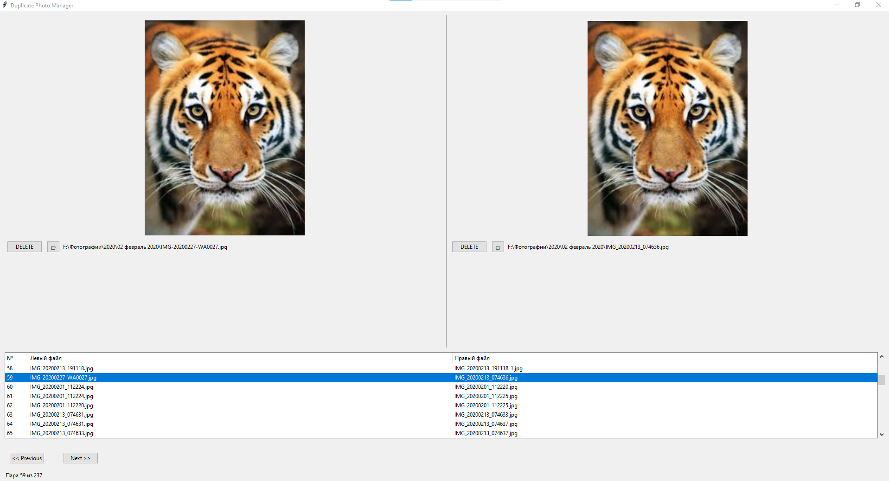

# Photo organizer 

Приложение предназначено для поиска дубликатов фотографий и автоматической сортировки изображений. Оно позволяет эффективно управлять коллекцией фотографий, находить повторяющиеся файлы, перемещать их в корзину и организовывать медиафайлы по датам. 

## Основные возможности  

1. Поиск дубликатов : 
    * Приложение сканирует указанную директорию и находит все дубликаты фотографий.
    * Использует хэширование изображений для точного определения совпадений.
     

2. Перемещение дубликатов : 
    * Все найденные дубликаты перемещаются в специальную папку "Trash" для дальнейшего управления.
     

3. Автоматическая сортировка : 
    * Фотографии сортируются по дате создания (из имени файла или EXIF-данных) и помещаются в соответствующие папки   (год/месяц).
         

4. Восстановление удаленных файлов : 
    * Позволяет просматривать содержимое корзины и восстанавливать удаленные файлы в исходные папки.
     
     

## Как начать работу  

0. Скачайте последний релиз и распакуйте архив

1. Отредактируйте файл config.yaml и укажите путь к вашей библиотеке фотографий: 
```yaml
    library:
      path: "F:\\Фотографии"
```
     

2. Запустите необходимые BAT-файлы в следующем порядке: 
    * 1-find-duplicates.bat: Находит дубликаты в указанной директории.(При первичном запуске создает БД по библиотеке фотографий)
    * 2-move-duplicates.bat: Перемещает дубликаты в корзину.
    * 3-photo_organizer.bat: Сортирует уникальные фотографии по датам. Перемещает в папку sorted_photos
    * 4-find_internal_duplicates.bat: Находит дубликаты внутри вашей основной библиотеки.
    * 5-photo_recovery.bat: Запускает интерфейс для восстановления удаленных файлов. (на основе информации от find_internal_duplicates.bat)
	* 6-update_library.bat: Запускает процесс обновления БД по библиотеке фотографий (сканирует новые файлы)
	* 7-duplicates_gui.bat: GUI интерфейс для работы с дубликатами, на основе информации от find_internal_duplicates.bat
         
     

## Технические требования  
* Python 3.13.2 (64-bit)
* Библиотеки: PIL (Pillow), sqlite3, multiprocessing, tqdm, yaml, tkinter
     

## Documentation in English  

The application is designed for finding duplicate photos and automatically organizing image collections. It helps efficiently manage a photo library by identifying duplicate files, moving them to a trash folder, and organizing media files by date. 
## Key Features  

1. Duplicate Detection : 
    * Scans the specified directory and identifies all duplicate images.
    * Uses image hashing for precise matching.
         

2. Duplicate Removal : 
    * Moves detected duplicates to a special "Trash" folder for further management.
     

3. Automatic Sorting : 
    * Sorts unique photos by creation date (extracted from filenames or EXIF data) into corresponding folders (year/month).
     

4. File Recovery : 
    * Allows viewing the contents of the trash folder and restoring deleted files to their original locations.
     
     

## Getting Started  

0. Download the latest release and unzip the archive

1. Edit the config.yaml file and specify the path to your photo library: 
```yaml

    library:
      path: "F:\\Photos"
```
     

2. Run the required BAT files in the following order: 
    * 1-find-duplicates.bat: Detects duplicates in the specified directory. (When first launched, it creates a database for the photo library)
    * 2-move-duplicates.bat: Moves duplicates to the trash folder.
    * 3-photo_organizer.bat: Sorts unique photos by date. Moves to sorted_photos folder
    * 4-find_internal_duplicates.bat: Finds duplicates within your main library.
    * 5-photo_recovery.bat: Launches the interface for restoring deleted files. (based on information from find_internal_duplicates.bat)
	* 6-update_library.bat: Starts the process of updating the database for the photo library (scans new files)
	* 7-duplicates_gui.bat: GUI interface for working with duplicates, based on information from find_internal_duplicates.bat
         
     

## Technical Requirements  

* Python 3.13.2 (64-bit)
* Libraries: PIL (Pillow), sqlite3, multiprocessing, tqdm, yaml, tkinter
     